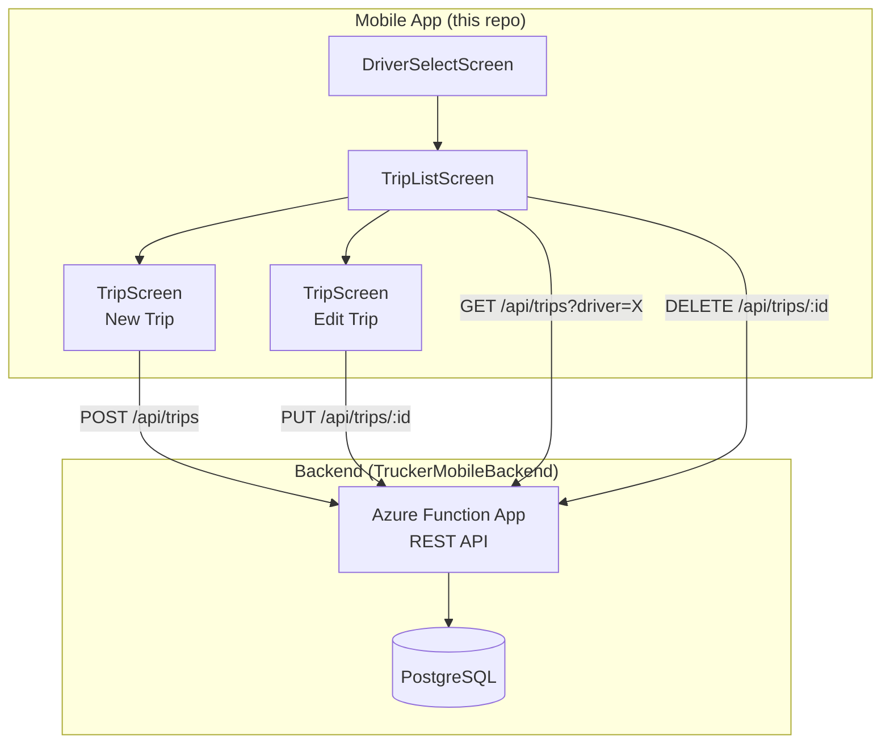
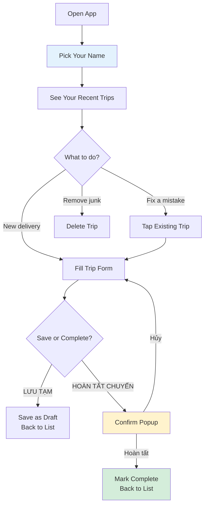
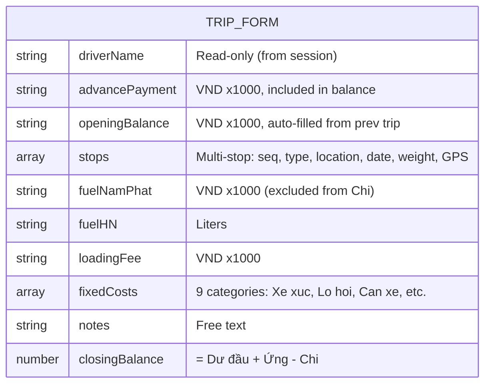
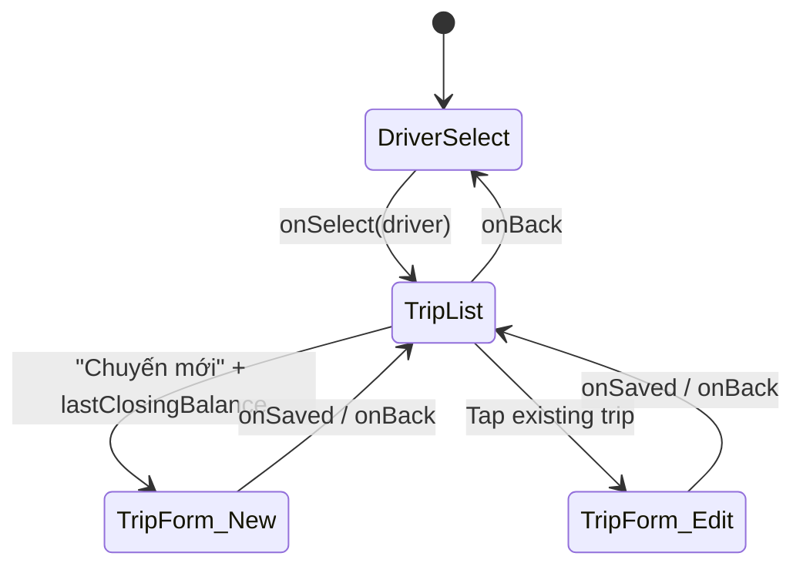

# NhuTin Trucker Mobile

Cross-platform mobile app for truck drivers to log trip details, track costs, and manage deliveries. Built with Expo (React Native), targeting iOS, Android, and Web.

## System Architecture



## User Flow

Three-screen app designed for truckers with minimal tech literacy. Every interaction is max 2 taps.



## Trip Data Model



## Balance Chaining

Trips chain like a wallet — each trip's closing balance carries forward as the next trip's opening balance:

```mermaid
flowchart LR
    subgraph "Chuyến 1"
        A1["Dư đầu: 0"] --> B1["+ Ứng: 5,000"]
        B1 --> C1["- Chi: 3,000"]
        C1 --> D1["Dư cuối: 2,000"]
    end
    subgraph "Chuyến 2"
        A2["Dư đầu: 2,000"] --> B2["+ Ứng: 6,000"]
        B2 --> C2["- Chi: 4,000"]
        C2 --> D2["Dư cuối: 4,000"]
    end
    subgraph "Chuyến 3"
        A3["Dư đầu: 4,000"] --> B3["+ Ứng: 0"]
        B3 --> C3["- Chi: 1,000"]
        C3 --> D3["Dư cuối: 3,000"]
    end
    D1 -.->|auto-fill| A2
    D2 -.->|auto-fill| A3

    style D1 fill:#d4edda
    style D2 fill:#d4edda
    style D3 fill:#d4edda
```



**Formula:** `Dư cuối = Dư đầu + Ứng − Chi` (Chi excludes Dầu Nam Phát)

- **Dư đầu** (opening balance) — auto-populated from previous trip's Dư cuối, editable
- **Ứng** (advance payment) — cash given to the driver before the trip
- **Chi** (expenses) — loading fees + fixed costs (Nam Phat fuel tracked separately, excluded from balance)
- Carries over across days (Monday's last Dư cuối → Tuesday's first Dư đầu)

## Features

### Core
- **Driver session** — pick your name once, see only your trips
- **Trip list** — recent trips (last 2 days) grouped by day with trip numbers, pull-to-refresh
- **In-place editing** — tap any trip to modify it (PUT, no duplicates)
- **Draft / Complete lifecycle** — save progress, confirm when done
- **Confirmation popup** — "Xác nhận hoàn tất chuyến?" before finalizing
- **2-day edit window** — correct mistakes after completion

### Trip Form
- Pickup & delivery logging (date, location, weight in KG)
- Fuel costs: Nam Phat (VND), HN (liters)
- Loading/unloading fees (VND)
- Dynamic additional costs (fines, tolls, medical, etc.)
- Weight validation: pickup vs delivery difference capped at 1,000 KG
- Delivery date auto-bumps if pickup date moves forward
- All currency fields with comma separators (VND, integers only)

### Cross-Platform
- Native `Alert.alert` on iOS/Android, `window.confirm`/`window.alert` on Web
- Platform-aware keyboard avoidance
- Safe area handling for notches and status bars

## Project Structure

```
TruckerMobile/
├── App.tsx                     # Navigation state machine (3 screens)
├── src/
│   ├── DriverSelectScreen.tsx  # Screen 1: pick your name
│   ├── TripListScreen.tsx      # Screen 2: recent trips + new/edit/delete
│   ├── TripScreen.tsx          # Screen 3: trip form (create & edit)
│   ├── api.ts                  # API client: submit, update, get, delete trips
│   ├── alert.ts                # Cross-platform alert/confirm helpers
│   ├── types.ts                # TypeScript interfaces, driver list, location codes
│   ├── utils.ts                # Number formatting, ID generation
│   ├── config.ts               # API endpoint & GPS config
│   ├── theme.ts                # Color palette (Material Design 3 inspired)
│   ├── PickerModal.tsx         # Bottom sheet picker (reusable)
│   └── DatePickerModal.tsx     # Cross-platform date picker
├── app.json                    # Expo config
├── tsconfig.json               # TypeScript (strict mode)
└── package.json                # Dependencies
```

## Screen Navigation

No external navigation library — uses a simple state machine in `App.tsx` for zero added bundle size:



## Tech Stack

| Layer | Technology |
|-------|-----------|
| Framework | Expo SDK 54, React Native 0.77 |
| Language | TypeScript (strict) |
| Date Picker | @react-native-community/datetimepicker |
| Safe Area | react-native-safe-area-context |
| Icons | @expo/vector-icons (MaterialIcons) |
| API | fetch (no axios — fewer deps) |
| Navigation | State machine in App.tsx (no react-navigation) |
| Styling | StyleSheet (no styled-components — RN native) |

## Getting Started

### Prerequisites
- Node.js 18+
- Expo CLI (`npx expo`)

### Run locally
```bash
npm install
npx expo start
```

- Press `w` for web, `i` for iOS simulator, `a` for Android emulator
- Or scan QR with Expo Go on your phone

### API Configuration

Edit `src/config.ts`:
```typescript
const Config = {
  apiBaseUrl: __DEV__
    ? 'http://localhost:7071/api'    // Local Azure Functions
    : 'https://nhutin-trucker-api.azurewebsites.net/api',  // Production
  endpoint: '/trips',
};
```

## Design Decisions

| Decision | Rationale |
|----------|-----------|
| No react-navigation | 3 screens, linear flow — state machine is simpler and adds 0 KB to bundle |
| No auth screen | Drivers share devices, SME context — name picker is sufficient identity |
| Driver name as "session" | Prevents mid-form driver switching bugs; naturally separates trip data |
| Cross-platform alert helper | `Alert.alert` is no-op on web; helper uses `window.confirm` as fallback |
| No Redux/Zustand | Form state is local to TripScreen; trip list refetches on mount. No shared state needed |
| Comma formatting | VND has no decimals — integer display with comma separators matches driver expectations |

## Related Repos

- **[TruckerMobileBackend](https://github.com/maiduydung/TruckerMobileBackend)** — Azure Function App REST API (Python, PostgreSQL)
